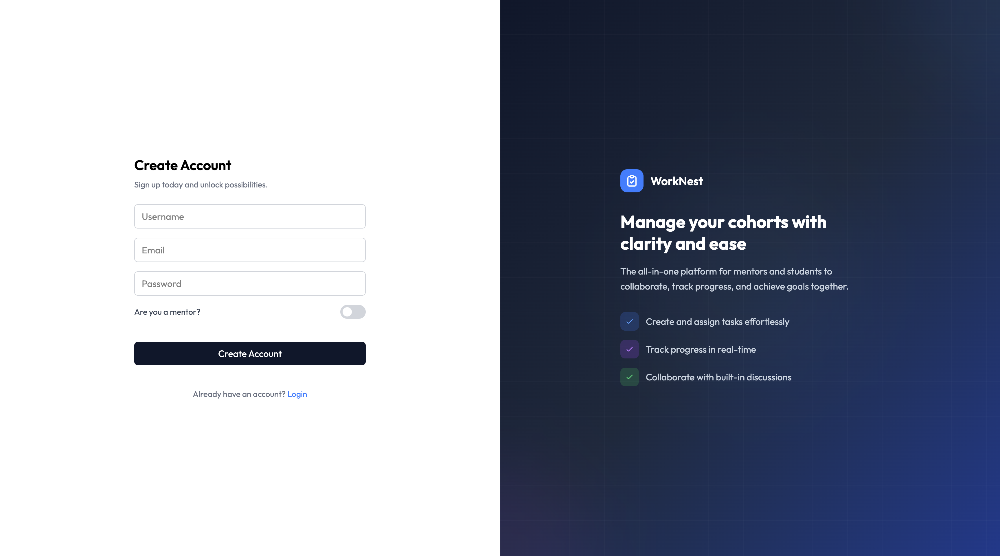
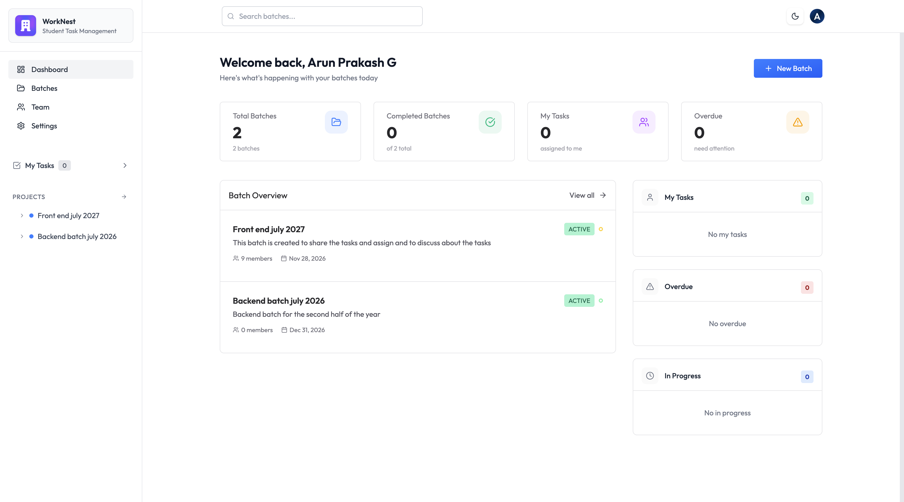

# WorkNest – Full-Stack Task Management Platform

WorkNest is a full-stack task management platform built with React, Node.js, Express, and MongoDB that streamlines task assignment, collaboration, and progress tracking through secure JWT-based authentication and role-based access control.

**[🌐 Live Demo](https://worknest-psi-nine.vercel.app/auth)** • **[📂 Source Code](https://github.com/arunprakash12345/Worknest)** • **[🐞 Report Bug](https://github.com/arunprakash12345/Worknest/issues)**

## Login Screen


## Dashboard


---

## Why I Built This

Managing mentor-student cohorts often involves scattered communication, missed deadlines, and limited visibility into progress. WorkNest was built to centralize task management, collaboration, and progress tracking into a single, easy-to-use platform for both mentors and students.

---

## Key Capabilities

- Secure JWT-based authentication and authorization
- Role-based dashboards for mentors and students
- Task assignment, tracking, and collaboration workflows
- RESTful backend with MongoDB persistence
- Responsive React frontend with Redux Toolkit state management

  
## Features

- **Role-based access** — Mentors and students see different dashboards
- **Batch management** — Create cohorts, add/remove members, track progress
- **Task workflow** — Create → Assign → Track → Complete with per-assignee status
- **Discussion threads** — Comments on each task for feedback
- **Calendar view** — Never miss a deadline
- **Analytics** — Charts showing completion rates, task distribution
- **Global search** — Find any batch or task instantly
- **Dark mode** — Enhanced usability in low-light environments

## Highlights

- JWT Authentication
- Role-Based Access Control (RBAC)
- Protected Routes
- Responsive Design
- RESTful APIs
- Redux Toolkit State Management
- MongoDB Persistence


## Tech Stack

| Category | Technologies |
|----------|--------------|
| Frontend | React 19, Redux Toolkit, React Router v7, Tailwind CSS, Recharts |
| Backend | Node.js, Express 5, JWT Authentication, RBAC Middleware |
| Database | MongoDB, Mongoose |
| Deployment | Vercel, Render |

---
## Architecture

```text
React Client
      │
      ▼
Express REST API
      │
      ▼
JWT Authentication
      │
      ▼
MongoDB Database
```

## Run Locally

```bash
# Clone
git clone https://github.com/arunprakash12345/Worknest.git
cd Worknest

# Install dependencies
npm install
cd backend && npm install

# Set up environment variables
# Root .env: VITE_API_URL=http://localhost:5000/api
# backend/.env: MONGO_URI, JWT_SECRET, PORT=5000

# Run
cd backend && npm start   # API on :5000
cd .. && npm run dev      # Frontend on :5173
```

---

## Project Structure

```
├── src/
│   ├── components/    # UI components
│   ├── pages/         # Route pages
│   ├── features/      # Redux slices
│   └── utils/         # API helpers
├── backend/
│   ├── controllers/   # Route handlers
│   ├── models/        # Mongoose schemas
│   ├── routes/        # API endpoints
│   └── middleware/    # Auth, validation
```

---

## REST API Overview

```
POST   /api/auth/register     # Sign up
POST   /api/auth/login        # Sign in
GET    /api/batches           # List batches
POST   /api/batches           # Create batch
GET    /api/tasks?batch=:id   # Get batch tasks
POST   /api/tasks             # Create task
PUT    /api/tasks/:id/status  # Update status
GET    /api/tasks/my-tasks    # User's assigned tasks
```

---

## Engineering Learnings

During the development of WorkNest, I gained hands-on experience with:

- Designing secure authentication using JWT.
- Implementing Role-Based Access Control (RBAC).
- Structuring a scalable Express backend using modular architecture.
- Managing complex application state with Redux Toolkit.
- Building and integrating RESTful APIs between the frontend and backend.

## What's Next

- [ ] Real-time notifications
- [ ] File attachments
- [ ] Activity timeline
- [ ] Audit logs
- [ ] Email notifications
- [ ] GitHub PR integration
      

---

## Connect

**Arun Prakash** — [LinkedIn](https://www.linkedin.com/in/arunprakashux/)

---
## License
This project is licensed under the MIT License.

*> Built to demonstrate modern full-stack development practices using React, Node.js, Express, MongoDB, and secure authentication.*
